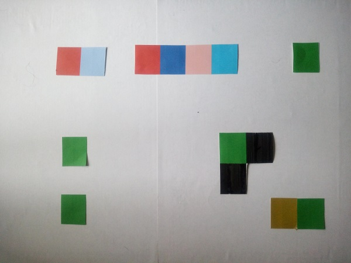
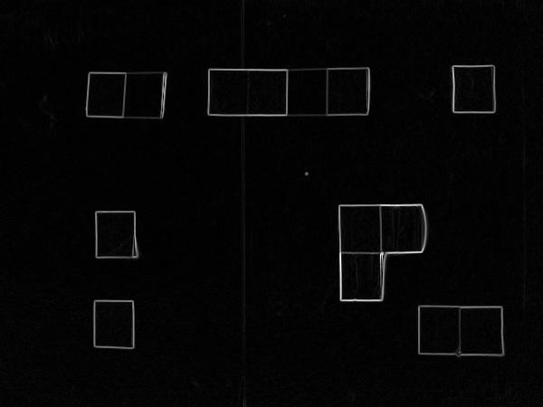
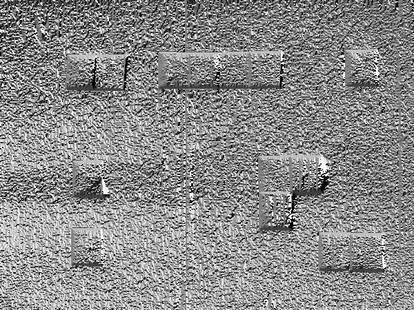
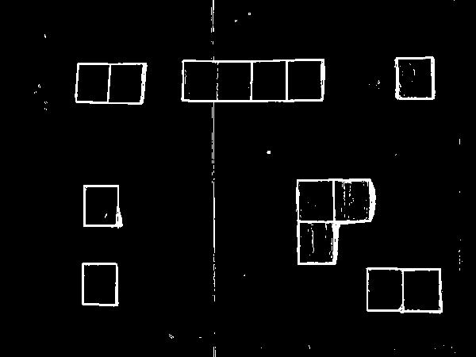
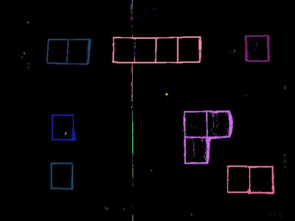

# PIET4Kids

Make PIET programs in real life. The goal is to be able to execute a built-in reality PIET program.

In order to do so:
 - a camera take a picture of the program
 - the program extract the associated PIET programm from the picture

# Pietification

First step consist in extracting PIET program from picture.
example picture:

### Sobel filters

To detected squares edges, i compute gradient magnitude and gradient direction.

Gradient magnitude:

Gradient direction:

### Threshold

From the gradient magnitude previously computed, i only keep pixels above a given threshold.

### Computation of undirectional weigted graph

For pixels above threshold, i regroup them into connected components

